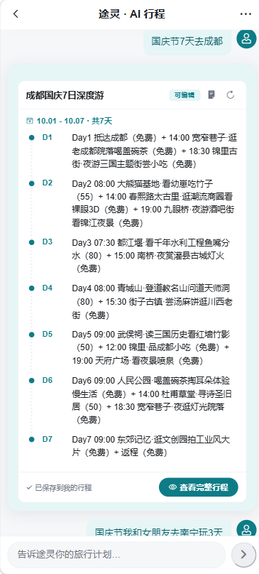
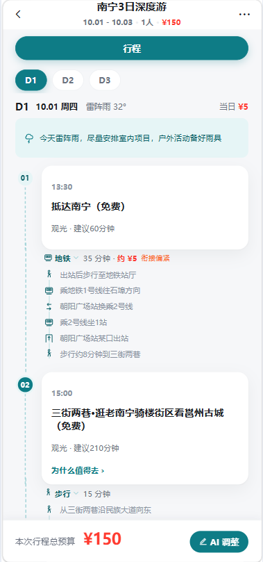
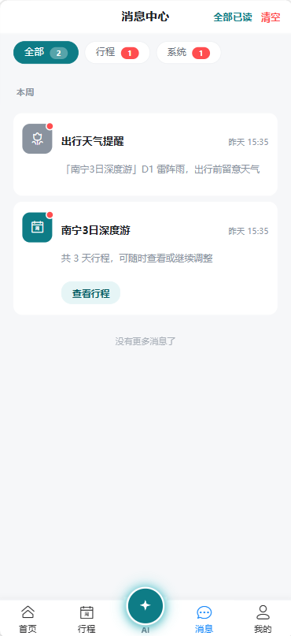

# 途灵 · 智能旅游助手

> 移动端 H5 智能旅游规划助手：一句话说出想去哪，AI 从规划到落地生成一条可编辑的行程。

用户在与「途灵小星」的对话中提出需求，AI 规划行程并落库为可调整的时间轴；行程支持排序、打卡、预算与天气联动，景点之间的交通衔接会给出可执行的分步走法（乘几号线、在哪换乘、哪站下、哪个口出）。

## 界面展示

| 首页 | AI 对话 |
| :---: | :---: |
|  |  |

| 行程详情 | 消息中心 |
| :---: | :---: |
|  |  |

## 核心能力

### AI 对话与行程规划

- **流式对话**：SSE 逐字输出，生成中可随时停止；AI 消息带「途灵小星」标识，支持复制与重试。
- **意图分流**：一次对话区分行程规划、攻略、美食、问答四类诉求，只有行程意图才会渲染成行程板块。
- **一键行程生成**：`POST /v1/plan/trip` 由后端串行编排「生成 → 提取城市与景点 → 查天气 → 补交通与天气建议 → 落库」，前端一次请求拿到完整行程。
- **Agent 自主工具循环**：模型自己判断该调哪个工具（查天气、重排行程），最多 4 轮；工具参数经 zod 校验，校验失败回喂模型自纠而非中断请求，前端实时展示「调用了什么」。

### 行程管理

- **时间轴**：按天展示行程项，拖动排序时时间固定在槽位（09:00 / 11:00 / 13:00…），保持递增不随卡片走动。
- **打卡与预算**：行程项可打卡；预算按人均价累加，成人权重 1、儿童 0.5，人数变更后实时重算。
- **天气联动**：按日展示天气状况与温度（Open-Meteo，支持未来 15 天），出行前推送预警消息。
- **乐观锁**：写操作携带 `If-Match: <revision>`，冲突返回 409，避免多端覆盖。

### 交通衔接

- **方式可切换**：每段给出主推方式与 2~3 个备选，点击衔接条即可本地切换，零延迟不发请求。
- **分步走法**：结构化输出乘车、换乘、下车、出站四类步骤，渲染成图标动线，例如「乘 1 号线 → 金湖广场换乘 3 号线 → 青秀站 D 口出站」。
- **缓存与容错**：结果按相邻行程项缓存并原地升级；AI 不可用或网络抖动时静默降级，不影响主流程。

### 消息中心

- **结构化通知**：行程保存、日期或人数变更、单天补排、整体重排、天气预警均落为消息。
- **交互完整**：类型分类与未读徽标、点击整卡标读并跳转落点、下拉刷新、左滑删除。

## 技术栈

| 层 | 选型 |
| --- | --- |
| 前端 | Vue 3 + Vant UI 4 + Vue Router + Pinia + Axios + Vite + SSE |
| 后端 | Express + `node:sqlite`（Node 内置，零第三方依赖）+ JWT |
| AI | DeepSeek（OpenAI 兼容格式，可通过 `.env` 切换任意兼容服务） |
| 天气 | Open-Meteo（免费、无需 Key） |

## 项目结构

```
backend/                 Express 后端（API + SQLite）
  src/agent/             Agent 循环与可调用工具声明
  src/orchestrator/      行程生成编排中枢（串行流水线）
  src/routes/            业务路由（auth / trip / plan / agent / chat / hop / message / city / weather / user）
  src/utils/             共用工具（AI 调用、天气、日期口径、通知、行程写入…）
  src/db.js              建表、迁移与查询封装
trval-h5/                前端 H5（Vue 3 + Vant）
  src/views/             页面（首页 / 对话 / 行程列表 / 行程详情 / 消息 / 我的 / 登录）
  src/api/               接口封装（含 SSE 流式）
  src/utils/             request 封装、SSE 解析、图标资源
```

## 快速开始

```bash
# 后端（backend/ 下）
cp .env.example .env    # 填入 AI_API_KEY
npm install
npm run seed            # 初始化种子数据（4 城市 + 16 景点 + 示例行程）
npm run dev             # http://localhost:3001  (node --watch 热重载)

# 前端（trval-h5/ 下）
npm install
npm run dev             # http://localhost:5175  (Vite 代理 /api → 3001)
```

演示账号：`traveler / 123456`，管理员 `admin / 123456`。

## 接口约定

- 统一信封 `{ code, data, message }`，`code` 非 0 / 200 时前端弹出 message 并 reject。
- SSE 逐字推送，以 `[DONE]` 结束；错误按 HTTP 状态映射为友好文案（401 登录过期、429 请求频繁、502/503/504 服务不可用）。
- 行程写操作带乐观锁 `If-Match: <revision>`，冲突返回 409。
- 「锦上添花」的请求（交通衔接、天气）失败时静默降级，不打断用户操作。

## 设计规范

- **配色比例**：80% 基础层（`#F6F7F9` / `#FFFFFF` / `#EDEFF2` / `#1A1D21` / `#6B7280`）、15% 品牌层（`#4096ff` 系列）、5% 强调层（`#FF6A2B`），区域比例严格控制。
- **AI 输出铁律**：行程项一律为 `名称（价格）`，免费写「免费」，价格为每人价 —— 后端据此统一解析人均价并累加预算。
- **导航结构**：底部三个标签（首页 / 行程 / 我的），消息入口收在首页顶栏铃铛。
- **降级优先**：天气、交通、通知任一环节失败都不拖垮主流程，缺数据就不展示，而不是报错。

## 版本

- **V2**（当前）：Agent 自主工具循环、行程生成编排层、交通衔接分步走法、消息中心、首页与行程页改版。
- **V1**：对话式信息流、时间轴行程、乐观锁与预算重算、Open-Meteo 天气接入。
